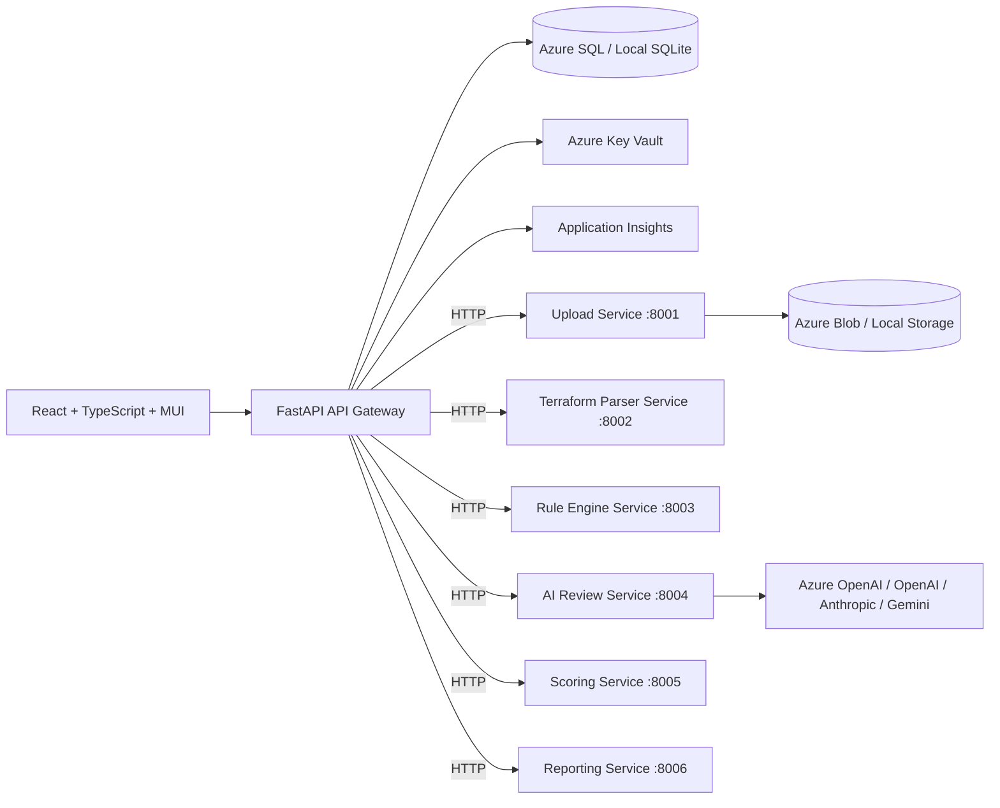

# AI-Powered Terraform Review Assistant

[](https://github.com/ashutosh9199/terraform-review-assistant-microservices/actions/workflows/build.yml)
[](https://github.com/ashutosh9199/terraform-review-assistant-microservices/actions/workflows/deploy.yml)
[](https://github.com/ashutosh9199/terraform-review-assistant-microservices/actions/workflows/terraform-apply.yml)
[](https://github.com/ashutosh9199/terraform-review-assistant-microservices/actions/workflows/codeql.yml)

Enterprise web platform for reviewing Azure Terraform projects with static analysis, governance checks, AI-assisted recommendations, scoring, and downloadable reports.

## Live Deployment (Capstone Track B: Azure AKS)

The app is deployed and running on Azure Kubernetes Service right now:

| | |
|---|---|
| **URL** | http://20.241.214.29 |
| **Demo login** | `admin@example.com` / `ChangeMe123!` |
| **Cluster** | `tra-aks-aks` (resource group `tra-aks-rg`, region `eastus`, K8s v1.34.8) |
| **Status** | 10/10 pods `Running` across 8 services; `terraform-apply`, `build`, and `deploy` all have recorded successful CI runs with manual approval gates exercised |

Verified end-to-end on this deployment: login → create project → upload a `.tf` file →
background pipeline (`upload-service` → `parser-service` → `rules-service` →
`scoring-service` → `reporting-service`) → scorecard + findings returned. The
`upload-service` pod authenticates to Azure Blob Storage purely via Workload
Identity (federated credential, zero static keys) — see
[docs/capstone-coverage.md](docs/capstone-coverage.md) for the full
requirement-by-requirement mapping with evidence.

**Monitoring (bonus):** a minimal Prometheus + Grafana stack runs in its own
`monitoring` namespace ([`kubernetes/monitoring/`](kubernetes/monitoring/)),
scraping real HTTP request/latency metrics from `api-gateway`'s `/metrics`
endpoint. Not exposed externally — view it via:
```
kubectl port-forward -n monitoring svc/grafana 3000:3000
```
then open `http://localhost:3000` (user `admin`, password from
`kubectl get secret grafana-admin -n monitoring -o jsonpath='{.data.admin-password}' | base64 -d`).
A "API Gateway" dashboard is auto-provisioned with request rate and p95 latency panels.

**GitOps (bonus):** ArgoCD runs in its own `argocd` namespace and manages the
`monitoring` stack (Prometheus + Grafana) by pulling directly from this
repo's `main` branch — any commit under [`kubernetes/monitoring/`](kubernetes/monitoring/)
is auto-synced, with drift correction and pruning. Production (image-tag
substitution + manual approval gate) stays on push-based CD via `deploy.yml`
deliberately — see [`argocd/monitoring-application.yaml`](argocd/monitoring-application.yaml)
for the Application definition. Not exposed externally — view it via:
```
kubectl port-forward -n argocd svc/argocd-server 8080:443
```
then open `https://localhost:8080` (user `admin`, password from
`kubectl -n argocd get secret argocd-initial-admin-secret -o jsonpath='{.data.password}' | base64 -d`).

> If the URL above is unreachable, the cluster has likely been torn down after
> evaluation to stop billing (see [docs/RESUME-DEPLOYMENT.md](docs/RESUME-DEPLOYMENT.md)
> to recreate it) — `terraform apply` in `infra/terraform/environments/aks`
> reprovisions everything from scratch.

## What It Does

- Upload `.tf`, `.tfvars`, and Terraform ZIP projects
- Parse Terraform HCL into structured resource inventory
- Run Azure security, governance, operations, cost, and quality rules
- Run specialist AI reviewers against deterministic evidence
- Generate infrastructure scorecards
- Export JSON, HTML, and PDF reports
- Manage LLM settings with provider auto-detection
- Provide an enterprise React dashboard

## Architecture



The application uses deterministic analysis first, then AI. Uploaded Terraform is parsed only; it is never executed.

## Repository Layout

```text
apps/
  api-gateway/        FastAPI gateway: auth, DB, REST API, review orchestration
  upload-service/     Validates, stores, and expands uploaded Terraform (:8001)
  parser-service/     Parses HCL into inventory + dependency graph (:8002)
  rules-service/      Deterministic Azure rule engine (:8003)
  ai-review-service/  Specialist LLM reviewers (:8004)
  scoring-service/    Weighted infrastructure scorecard (:8005)
  reporting-service/  JSON / HTML / PDF report generation (:8006)
  frontend/           React TypeScript Material UI app
infra/
  terraform/          Azure deployment modules and environments
scripts/
  run-all-dev.ps1     Launch the full stack locally (Windows)
.github/workflows/    CI/CD pipeline
docker-compose.yml    Local development stack (all services)
```

The gateway owns the database, authentication, and secrets. Each analysis stage
runs as its own stateless FastAPI service; the orchestrator in the gateway
sequences them over HTTP. The gateway's public REST API is unchanged, so the
frontend talks only to the gateway.

## Local Prerequisites

- Python 3.11+
- Node.js 20+
- Docker Desktop
- Terraform 1.6+

## Backend Setup

```powershell
cd apps/api-gateway
python -m venv .venv
.\.venv\Scripts\Activate.ps1
pip install -e ".[dev]"
copy .env.example .env
python -m app.bootstrap
uvicorn app.main:app --reload --port 8000
```

API docs:

```text
http://localhost:8000/docs
```

Default local admin created by `python -m app.bootstrap`:

```text
email: admin@example.com
password: ChangeMe123!
```

## Frontend Setup

```powershell
cd apps/frontend
npm install
npm run dev
```

Frontend:

```text
http://localhost:5173
```

## Docker Compose

Builds and runs the gateway, all six microservices, and the frontend:

```powershell
docker compose up --build
```

Services:

```text
Frontend:           http://localhost:5173
API Gateway:        http://localhost:8000
Docs:               http://localhost:8000/docs
upload-service:     internal :8001
parser-service:     internal :8002
rules-service:      internal :8003
ai-review-service:  internal :8004
scoring-service:    internal :8005
reporting-service:  internal :8006
```

The gateway container seeds the default admin user on startup.

## Run the Full Stack Locally Without Docker

Every service's dependencies are a subset of the gateway's, so a single helper
script manages one virtualenv and launches each service in its own window:

```powershell
./scripts/run-all-dev.ps1
```

On first run it creates the virtualenv **outside the OneDrive-synced project
folder** (default `%USERPROFILE%\tra-venv`) and installs all dependencies; this
avoids venvs breaking when OneDrive syncs them across machines. Subsequent runs
reuse it. Useful flags:

```powershell
./scripts/run-all-dev.ps1 -Setup              # force reinstall dependencies
./scripts/run-all-dev.ps1 -VenvDir D:\envs\tra # use a custom venv location
```

This starts upload (:8001), parser (:8002), rules (:8003), ai-review (:8004),
scoring (:8005), reporting (:8006), and the gateway (:8000), and seeds the
default admin user. For production-style isolation, give each service its own
virtualenv and `pip install -r requirements.txt`.

## LLM Provider Configuration

Open **Settings** in the UI and enter:

- API key
- Optional endpoint
- Optional model or Azure deployment name

Provider auto-detection supports:

- Azure OpenAI, when endpoint contains `openai.azure.com`
- OpenAI, when key resembles `sk-*`
- Anthropic, when key resembles `sk-ant-*`
- Google Gemini, when endpoint or model indicates Gemini
- OpenAI-compatible providers, when a custom endpoint is supplied

For Azure OpenAI, provide endpoint and deployment/model because the API key alone is not enough to infer deployment details.

Secrets are encrypted locally for development. In Azure, configure Key Vault and managed identity.

## API Overview

Core endpoints:

```text
POST /api/auth/login
GET  /api/dashboard/summary
POST /api/projects
GET  /api/projects
POST /api/reviews/upload
GET  /api/reviews/{review_id}
GET  /api/reviews/{review_id}/report.json
GET  /api/reviews/{review_id}/report.html
GET  /api/reviews/{review_id}/report.pdf
GET  /api/settings/llm
PUT  /api/settings/llm
```

## Azure Deployment

### AKS (Kubernetes) — primary

Production deployment runs on **Azure Kubernetes Service** with GitOps CI/CD and
pod-to-cloud Workload Identity. See **[docs/aks-deployment.md](docs/aks-deployment.md)**
for the full runbook and **[docs/capstone-coverage.md](docs/capstone-coverage.md)**
for the requirement-by-requirement coverage map.

```bash
./scripts/bootstrap-tfstate.sh                          # remote state (once)
cd infra/terraform/environments/aks
terraform init -backend-config=backend.hcl
terraform apply                                         # VNet, AKS, ACR, Blob, Workload Identity
```

The AKS stack provisions: VNet (public + private subnets), AKS (v1.29+, system +
user node pools, autoscaling, OIDC issuer + Workload Identity), Azure Container
Registry, Storage Account (Blob), user-assigned managed identity + federated
credential, Key Vault, Log Analytics + Application Insights. Kubernetes manifests
live in [`kubernetes/`](kubernetes/); the three pipelines live in
[`.github/workflows/`](.github/workflows/) (`build`, `deploy`, `terraform-apply`).

### App Service — legacy

```powershell
cd infra/terraform/environments/dev
terraform init
terraform plan
terraform apply
```

The App Service stack provisions:

- Resource Group
- Storage Account
- Azure SQL
- Key Vault
- App Service plan and apps
- Log Analytics Workspace
- Application Insights

## Security Notes

- Uploaded files are extension and size checked
- ZIP extraction blocks path traversal
- Terraform is parsed, never executed
- JWT auth and RBAC are enforced
- Audit logs are written for authentication, upload, settings, and review actions
- API keys are not returned after storage
- Production secrets should be stored in Azure Key Vault

## Development Commands

Backend:

```powershell
cd apps/api-gateway
ruff check app tests
pytest
```

Frontend:

```powershell
cd apps/frontend
npm run lint
npm run build
```

Terraform:

```powershell
cd infra/terraform/environments/dev
terraform fmt -recursive
terraform validate
```

## Production Roadmap

- Queue-based worker split with Azure Service Bus
- PDF rendering through Playwright or Azure Functions
- Checkov/tfsec optional evidence ingestion
- Tenant isolation and enterprise SSO
- Azure Cost Management API enrichment
- Policy-as-code import from Azure Policy
