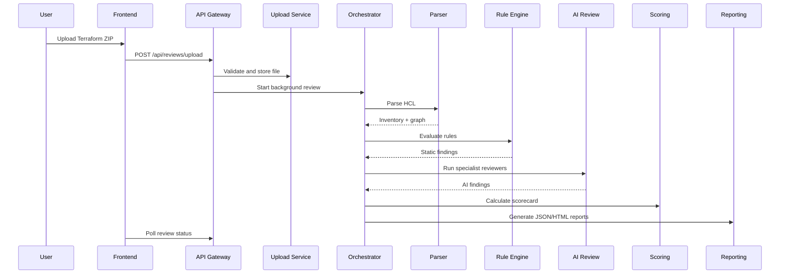

# Architecture

## Principles

- Deterministic evidence before AI recommendations
- Uploaded Terraform is parsed, never executed
- Service boundaries match the target microservices architecture
- Secrets are encrypted locally and should live in Azure Key Vault in production
- Findings are normalized so static rules and AI reviewers can be scored together

## Review Flow

## Service Boundaries

Each bounded context runs as its own deployable FastAPI service. The gateway
holds the database, auth, and secrets and orchestrates a review over HTTP:

- `apps/upload-service` (:8001): upload validation, persistence, and expansion
- `apps/parser-service` (:8002): Terraform inventory and dependency graph
- `apps/rules-service` (:8003): deterministic Azure rules
- `apps/ai-review-service` (:8004): specialist AI reviewers
- `apps/scoring-service` (:8005): scoring model
- `apps/reporting-service` (:8006): report generation
- `apps/api-gateway` (:8000): auth, database, REST API, and the orchestrator
  (`app/services/orchestrator.py` + `app/services/clients.py`) that sequences
  the services and persists results

See `services/README.md` for the request/response contract of each service.

## Data Model

Core persisted entities:

- Users and roles
- Projects
- Review jobs
- Findings
- Reports
- LLM settings
- Audit logs

## AI Design

The AI layer runs specialist reviewers:

- Security
- Cost
- Governance
- Operations

Each reviewer receives structured inventory, dependency graph, and static findings. The output is constrained to a normalized finding shape.
